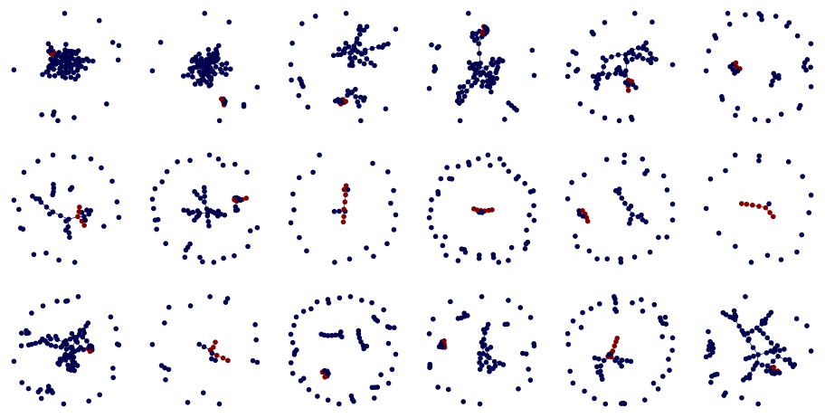

Shortest-Path
=============

Fix path and import caldera
^^^^^^^^^^^^^^^^^^^^^^^^^^^

.. code:: ipython3

    from os.path import join, isfile
    import os
    import sys
    
    def find_pkg(name: str, depth: int):
        if depth <= 0:
            ret = None
        else:
            d = ['..'] * depth
            path_parts = d + [name, '__init__.py']
            
            if isfile(join(*path_parts)):
                ret = d
            else:
                ret = find_pkg(name, depth-1)
        return ret
    
    def find_and_ins_syspath(name: str, depth: int):
        path_parts = find_pkg(name, depth)
        if path_parts is None:
            raise RuntimeError("Could not find {}. Try increasing depth.".format(name))
        path = join(*path_parts)
        if path not in sys.path:
            sys.path.insert(0, path)
    
    try:
        import caldera
    except ImportError:
        find_and_ins_syspath('caldera', 3)
    
    import caldera

Data Generation
---------------

To generate examples, we are going to use caldera’s networkx graph
generator utilties and the ``caldera.transforms.networkx`` module to
perform graph preprocessing.

.. code:: ipython3

    import networkx as nx
    import numpy as np
    import pprint
    import matplotlib.pyplot as plt
    from caldera.testing import annotate_shortest_path
    from caldera.transforms import Compose
    from caldera.transforms.networkx import NetworkxAttachNumpyOneHot
    from caldera.transforms.networkx import NetworkxNodesToStr
    from caldera.transforms.networkx import NetworkxSetDefaultFeature
    from caldera.transforms.networkx import NetworkxToDirected
    from caldera.utils._tools import _resolve_range
    from caldera.utils.nx.generators import _uuid_chain
    from caldera.utils.nx.generators import chain_graph
    from caldera.utils.nx.generators import compose_and_connect
    from caldera.utils.nx.generators import random_graph
    %matplotlib inline
    
    def generate_shorest_path_example(n_nodes, density, path_length, compose_density = None):
        d = _resolve_range(density)
        l = _resolve_range(path_length)
        if compose_density is None:
            cd = d
        else:
            cd = _resolve_range(compose_density)
        path = list(_uuid_chain(l))
        h = chain_graph(path, nx.Graph)
        g = random_graph(n_nodes, density=d)
        graph = compose_and_connect(g, h, cd)
    
        annotate_shortest_path(
            graph,
            True,
            True,
            source_key="source",
            target_key="target",
            path_key="shortest_path",
            source=path[0],
            target=path[-1],
        )
    
        preprocess = Compose(
            [
                NetworkxSetDefaultFeature(
                    node_default={"source": False, "target": False, "shortest_path": False},
                    edge_default={"shortest_path": False},
                ),
                NetworkxAttachNumpyOneHot(
                    "node", "source", "_features", classes=[False, True]
                ),
                NetworkxAttachNumpyOneHot(
                    "node", "target", "_features", classes=[False, True]
                ),
                NetworkxAttachNumpyOneHot(
                    "edge", "shortest_path", "_target", classes=[False, True]
                ),
                NetworkxAttachNumpyOneHot(
                    "node", "shortest_path", "_target", classes=[False, True]
                ),
                NetworkxSetDefaultFeature(
                    node_default={"_features": np.array([0.0]), "_target": np.array([0.0])},
                    edge_default={"_features": np.array([0.0]), "_target": np.array([0.0])},
                    global_default={
                        "_features": np.array([0.0]),
                        "_target": np.array([0.0]),
                    },
                ),
                NetworkxNodesToStr(),
                NetworkxToDirected(),
            ]
        )
    
        return preprocess([graph])[0]
    
    
    def draw_shortest_path(g, ax=None, node_size=10, edge_width=0.5, cmap=None, pos=None):
        if ax is None:
            fig = plt.figure(figsize=(3, 3))
            ax = fig.gca()
        ax.axis('off')
        
        g = nx.to_undirected(g)
        nodelist = list(g.nodes)
    
        node_color = []
        for n in nodelist:
            node_color.append(g.nodes[n]['shortest_path'])
    
        edge_list = []
        edge_color = []
        for n1, n2, edata in g.edges(data=True):
            edge_list.append((n1, n2))
            edge_color.append(edata['shortest_path'])
    
        if cmap is None:
            cmap = plt.get_cmap('seismic')
        if pos is None:
            pos = nx.layout.spring_layout(g)
        elif callable(pos):
            pos = pos(g)
        nx.draw_networkx_nodes(g, pos=pos, node_color=node_color, node_size=node_size, ax=ax, cmap=cmap)
        nx.draw_networkx_edges(g, pos=pos, width=edge_width, edge_color=edge_color, ax=ax, edge_cmap=cmap)
        return ax
        
    
    def custom_layout(g):
        s1 = []
        s2 = []
        for n, ndata in g.nodes(data='shortest_path'):
            if ndata:
                s1.append(n)
            else:
                s2.append(n)
    
        sg1 = g.subgraph(s1)
        sg2 = g.subgraph(s2)
    
        p1 = nx.layout.spring_layout(sg1)
        p2 = nx.layout.spring_layout(sg2)
    
        pos = {}
        for p_ in [p1, p2]:
            for n in p_:
                pos[n] = p_[n]
        return pos
            
    
    g = generate_shorest_path_example((10, 100), (0.03, 0.03), (5, 10), (0.01, 0.02))
    draw_shortest_path(g, pos=custom_layout)

.. parsed-literal::

    /home/justin/.cache/pypoetry/virtualenvs/caldera-fF8F2ZWq-py3.7/lib/python3.7/site-packages/traitlets/traitlets.py:2945: FutureWarning: --rc={'figure.dpi': 96} for dict-traits is deprecated in traitlets 5.0. You can pass --rc <key=value> ... multiple times to add items to a dict.
      FutureWarning,

.. code:: ipython3

    fig, axes = plt.subplots(3, 6, figsize=(12, 6))
    for row in axes:
        for ax in row:
            g = generate_shorest_path_example((100, 150), (0.01, 0.03), (5, 30), (0.005, 0.02))
            draw_shortest_path(g, ax, node_size=1, edge_width=0.2, pos=custom_layout)

.. image:: shortest_path_files/shortest_path_5_0.png

We can convert ``networkx.Graph`` into GraphData

.. code:: ipython3

    from caldera.data import GraphData
    
    input_graph = GraphData.from_networkx(g, feature_key='_features')
    target_graph = GraphData.from_networkx(g, feature_key='_target')
    
    print(input_graph)
    print(target_graph)

.. parsed-literal::

    <GraphData size(n,e,g)=torch.Size([169, 450, 1]) features(n,e,g)=torch.Size([4, 1, 1])>
    <GraphData size(n,e,g)=torch.Size([169, 450, 1]) features(n,e,g)=torch.Size([2, 2, 1])>

Creating Dataset
~~~~~~~~~~~~~~~~

Generate ``networkx.Graphs``, annotate the shortest path, convert
features to ``np.ndarray``.

.. code:: ipython3

    from caldera.dataset import GraphDataset
    from caldera.data import GraphData, GraphBatch
    from caldera.data import GraphDataLoader
    from tqdm import tqdm
    
    NUM_GRAPHS = 1000
    NUM_NODES = (10, 100)
    DENSITY = (0.01, 0.03)
    PATH_LEN  = (5, 10)
    COMPOSITION_DENSITY  = (0.01, 0.02)
    
    nx_graphs = []
    for _ in tqdm(range(NUM_GRAPHS)):
        nxg = generate_shorest_path_example(NUM_NODES, DENSITY, PATH_LEN, COMPOSITION_DENSITY)
        nx_graphs.append(nxg)

.. parsed-literal::

    100%|██████████| 1000/1000 [00:03<00:00, 263.22it/s]

Check generated graphs.

.. code:: ipython3

    from caldera.utils.functional import chain_each
    
    fig, axes = plt.subplots(3, 6, figsize=(12, 6))
    axes = chain_each()(axes)
    for ax, g in zip(axes, nx_graphs):
        draw_shortest_path(g, ax)

Create a paired data loader from input and target datalists.

.. code:: ipython3

    input_datalist = [GraphData.from_networkx(g, feature_key='_features') for g in nx_graphs]
    target_datalist = [GraphData.from_networkx(g, feature_key='_target') for g in nx_graphs]
    
    loader = GraphDataLoader(input_datalist, target_datalist, batch_size=32)
    
    for _input, _target in loader:
        print(_input)
        print(_target)
        break

.. parsed-literal::

    <GraphBatch size(n,e,g)=torch.Size([2118, 3444, 32]) features(n,e,g)=torch.Size([4, 1, 1])>
    <GraphBatch size(n,e,g)=torch.Size([2118, 3444, 32]) features(n,e,g)=torch.Size([2, 2, 1])>

Plot tensor object fingerprints.

.. code:: ipython3

    from caldera.data.utils import graph_matrix
    from caldera.utils import functional
    import seaborn as sns
    
    def adj_fingerprint(data, step_size=50):
        t = graph_matrix(data, include_edge_attr=False, fill_value=0, edge_value=1)
        n = t.numpy().squeeze()
        
        _n = np.zeros_like(n[:step_size, :step_size])
        for i in np.arange(0, n.shape[0], step=step_size):
            n2 = n[i:i+step_size, i:i+step_size]
            pad = step_size - n2.shape[0]
            if pad > 0:
                n2 = np.hstack([n2, np.zeros((n2.shape[0], pad))])
                n2 = np.vstack([n2, np.zeros((pad, n2.shape[1]))])
            _n += n2
        return _n
    
    def plot_fingerprint(data):
        fig = plt.figure(constrained_layout=True, figsize=(3, 0.5))
        gs = fig.add_gridspec(2, 5)
        ax1 = fig.add_subplot(gs[0, :-1])
        ax2 = fig.add_subplot(gs[1, :-1])
        ax3 = fig.add_subplot(gs[:, -1:])
        
        sns.heatmap(data.x[:, :1].T, ax=ax1, cbar=False, xticklabels=False, yticklabels=False, cmap="gray")
        sns.heatmap(data.e[:, :1].T, ax=ax2, cbar=False, xticklabels=False, yticklabels=False, cmap="gray")
        
        sns.heatmap(adj_fingerprint(data, step_size=10), cbar=False, xticklabels=False, yticklabels=False, cmap="gray")
        return fig
    
    def split(n, step_size):
        for i in np.arange(0, n.shape[0], step=step_size):
            n2 = n[i:i+step_size, i:i+step_size]
            pad = step_size - n2.shape[0]
            if pad > 0:
                n2 = np.hstack([n2, np.zeros((n2.shape[0], pad))])
                n2 = np.vstack([n2, np.zeros((pad, n2.shape[1]))])
            yield n2
    
    for _input, _target in functional.iter_count(3)(loader):
        fig = plot_fingerprint(_target)
    n = graph_matrix(_target).numpy().sum(axis=2)
    x = np.hstack(list(split(n, 100)))
    fig = plt.figure(figsize=(10, 2))
    ax = fig.gca()
    ax.set_title("Unrolled Adj Matrix")
    sns.heatmap(x, ax=ax, cbar=False)

.. parsed-literal::

    /home/justin/.cache/pypoetry/virtualenvs/caldera-fF8F2ZWq-py3.7/lib/python3.7/site-packages/seaborn/matrix.py:342: UserWarning: constrained_layout not applied.  At least one axes collapsed to zero width or height.
      ax.figure.draw(ax.figure.canvas.get_renderer())
    /home/justin/.cache/pypoetry/virtualenvs/caldera-fF8F2ZWq-py3.7/lib/python3.7/site-packages/IPython/core/pylabtools.py:132: UserWarning: constrained_layout not applied.  At least one axes collapsed to zero width or height.
      fig.canvas.print_figure(bytes_io, **kw)

.. image:: shortest_path_files/shortest_path_16_4.png

Notice that the input and target data are batched together according to
the batch size. Node attributes can be accessed via ``x``, edge
attributes ``e`` and global attributes ``g``. Now data is ready to be
loaded into a ``caldera`` network.

Graph Network
-------------

We are going to build a graph network to handle the data we just
created.

We are going to use a flexible ``encoder -> core[x] -> decoder``
architecture for this problem. The architecture consists of 4 main
networks, the **encoder**, **core**, **decoder**, and
**output_transform** networks. The **encoder** encodes graph data inputs
into arbitrary shapes. The **core** is the central graph message
processing network. The **decoder** decodes encoded data. Finally, the
**output_transform** transformed decoded data for final output.

Setting up the network looks like the following:

.. code:: python

   class Network(torch.nn.Module):

       def __init__(...):
           super().__init__()
       
           self.config = {...}

           self.encoder = ...
           self.core = ...
           self.decoder = ...
           self.out_transform = ...  

       def forward(self, data, steps, save_all: bool = False):
           """The encoder -> core -> decode loop"""
           encoded = self.encoder(data) # encode data
           
           outputs = []
           for _ in range(steps):
               latent = self.core(encoded)
               encoded = self.decoder(latent)
               outputs.append(self.out_transform(latent)
           return outputs

Flex Modules and Flex Dimensions
~~~~~~~~~~~~~~~~~~~~~~~~~~~~~~~~

Setting up this network with the correct dimensions can become tricky,
so we introduce a new module, the ``Flex`` module, which can resolve
unknown dimensions on runtime. To make a module a ``Flex`` module, we
just call ``Flex`` with any ``torch.nn.Module``, as in
``Flex(torch.nn.Linear)`` or ``Flex(MyAwesomeModule)``. To initialize
the module with unknown dimensions, you use the flexible dimension
object ``Flex.d`` in places where the dimension is to be resolve on
runtime, as in ``Flex(torch.nn.Linear)(Flex.d(), 10)``.

.. code:: ipython3

    from caldera.blocks import Flex
    import torch
    
    FlexLinear = Flex(torch.nn.Linear)
    
    linear0 = torch.nn.Linear(3, 10)
    flex_linear0 = FlexLinear(Flex.d(), 10)
    print(linear0)
    print(flex_linear0)

.. parsed-literal::

    Linear(in_features=3, out_features=10, bias=True)
    FlexBlock(
    	(unresolved_module): Linear(FlexDim(0, 1), 10, 
    )

Notice that the FlexBlock indicates it is current unresolved. To resovle
it, we need to provide it with a data example. You’ll see the module is
now resolved.

.. code:: ipython3

    example = torch.zeros((1, 10))
    
    flex_linear0(example)
    
    print(flex_linear0)

.. parsed-literal::

    FlexBlock(
      (resolved_module): Linear(in_features=10, out_features=10, bias=True)
    )

Aggregators
~~~~~~~~~~~

Aggregators are layers that indicate how data is processed and
aggregated between neighbors.

Final Network
~~~~~~~~~~~~~

.. code:: ipython3

    from caldera.blocks import NodeBlock, EdgeBlock, GlobalBlock
    from caldera.blocks import AggregatingNodeBlock, AggregatingEdgeBlock, AggregatingGlobalBlock
    from caldera.blocks import MultiAggregator
    from caldera.blocks import Flex
    from caldera.models import GraphCore, GraphEncoder
    from caldera.defaults import CalderaDefaults as defaults

.. code:: ipython3

    import torch
    from caldera.defaults import CalderaDefaults as defaults
    from caldera.blocks import Flex, NodeBlock, EdgeBlock, GlobalBlock, MLP, AggregatingEdgeBlock, AggregatingNodeBlock, \
        MultiAggregator, AggregatingGlobalBlock
    from caldera.models import GraphEncoder, GraphCore
    from caldera.data import GraphBatch
    
    
    class Network(torch.nn.Module):
        def __init__(
                self,
                latent_sizes=(16, 16, 1),
                out_sizes=(1, 1, 1),
                latent_depths=(1, 1, 1),
                dropout: float = None,
                pass_global_to_edge: bool = True,
                pass_global_to_node: bool = True,
                activation=defaults.activation,
                out_activation=defaults.activation,
                edge_to_node_aggregators=tuple(["add", "max", "mean", "min"]),
                edge_to_global_aggregators=tuple(["add", "max", "mean", "min"]),
                node_to_global_aggregators=tuple(["add", "max", "mean", "min"]),
                aggregator_activation=defaults.activation,
        ):
            super().__init__()
            self.config = {
                "sizes": {
                    'latent': {
                        "edge": latent_sizes[0],
                        "node": latent_sizes[1],
                        "global": latent_sizes[2],
                        "edge_depth": latent_depths[0],
                        "node_depth": latent_depths[1],
                        "global_depth": latent_depths[2],
                    },
                    'out': {
                        'edge': out_sizes[0],
                        'node': out_sizes[1],
                        'global': out_sizes[2],
                        'activation': out_activation,
                    }
                },
                'activation': activation,
                "dropout": dropout,
                "node_block_aggregator": edge_to_node_aggregators,
                "global_block_to_node_aggregator": node_to_global_aggregators,
                "global_block_to_edge_aggregator": edge_to_global_aggregators,
                "aggregator_activation": aggregator_activation,
                "pass_global_to_edge": pass_global_to_edge,
                "pass_global_to_node": pass_global_to_node,
            }
    
            ###########################
            # encoder
            ###########################
    
            self.encoder = self._init_encoder()
            self.core = self._init_core()
            self.decoder = self._init_encoder()
            self.output_transform = self._init_out_transform()
    
            self.output_transform = GraphEncoder(
                EdgeBlock(
                    torch.nn.Sequential(
                        Flex(torch.nn.Linear)(Flex.d(), 1), torch.nn.Sigmoid()
                    )
                ),
                NodeBlock(
                    torch.nn.Sequential(
                        Flex(torch.nn.Linear)(Flex.d(), 1), torch.nn.Sigmoid()
                    )
                ),
                GlobalBlock(Flex(torch.nn.Linear)(Flex.d(), 1)),
            )
    
        def _init_encoder(self):
            return GraphEncoder(
                EdgeBlock(Flex(MLP)(Flex.d(), self.config['sizes']['latent']['edge'], dropout=self.config['dropout'])),
                NodeBlock(Flex(MLP)(Flex.d(), self.config['sizes']['latent']['node'], dropout=self.config['dropout'])),
                GlobalBlock(Flex(MLP)(Flex.d(), self.config['sizes']['latent']['global'], dropout=self.config['dropout'])),
            )
    
        def _init_core(self):
            edge_layers = [self.config['sizes']['latent']['edge']] * self.config['sizes']['latent']['edge_depth']
            node_layers = [self.config['sizes']['latent']['node']] * self.config['sizes']['latent']['node_depth']
            global_layers = [self.config['sizes']['latent']['global']] * self.config['sizes']['latent']['global_depth']
    
            return GraphCore(
                AggregatingEdgeBlock(
                    torch.nn.Sequential(
                        Flex(MLP)(Flex.d(), *edge_layers, dropout=self.config['dropout'], layer_norm=True),
                    )
                ),
                AggregatingNodeBlock(
                    torch.nn.Sequential(
                        Flex(MLP)(Flex.d(), *node_layers, dropout=self.config['dropout'], layer_norm=True),
                    ),
                    Flex(MultiAggregator)(
                        Flex.d(),
                        self.config["node_block_aggregator"],
                        activation=self.config["aggregator_activation"],
                    ),
                ),
                AggregatingGlobalBlock(
                    torch.nn.Sequential(
                        Flex(MLP)(
                            Flex.d(), *global_layers, dropout=self.config['dropout'], layer_norm=True
                        ),
                    ),
                    edge_aggregator=Flex(MultiAggregator)(
                        Flex.d(),
                        self.config["global_block_to_edge_aggregator"],
                        activation=self.config["aggregator_activation"],
                    ),
                    node_aggregator=Flex(MultiAggregator)(
                        Flex.d(),
                        self.config["global_block_to_node_aggregator"],
                        activation=self.config["aggregator_activation"],
                    ),
                ),
                pass_global_to_edge=self.config["pass_global_to_edge"],
                pass_global_to_node=self.config["pass_global_to_node"],
            )
    
        def _init_out_transform(self):
            return GraphEncoder(
                EdgeBlock(
                    torch.nn.Sequential(
                        Flex(torch.nn.Linear)(Flex.d(), self.config['sizes']['out']['edge']),
                        self.config['sizes']['out']['activation']()
                    )
                ),
                NodeBlock(
                    torch.nn.Sequential(
                        Flex(torch.nn.Linear)(Flex.d(), self.config['sizes']['out']['node']),
                        self.config['sizes']['out']['activation']()
                    )
                ),
                GlobalBlock(
                    torch.nn.Sequential(
                        Flex(torch.nn.Linear)(Flex.d(), self.config['sizes']['out']['global']),
                        self.config['sizes']['out']['activation']()
                    )
                )
            )
    
        def _forward_encode(self, data):
            e, x, g = self.encoder(data)
            return GraphBatch(x, e, g, data.edges, data.node_idx, data.edge_idx)
    
        def _forward_decode(self, data):
            e, x, g = self.decoder(data)
            return GraphBatch(x, e, g, data.edges, data.node_idx, data.edge_idx)
    
        def _forward_core(self, latent0, data):
            e = torch.cat([latent0.e, data.e], dim=1)
            x = torch.cat([latent0.x, data.x], dim=1)
            g = torch.cat([latent0.g, data.g], dim=1)
            data = GraphBatch(x, e, g, data.edges, data.node_idx, data.edge_idx)
            e, x, g = self.core(data)
            return GraphBatch(x, e, g, data.edges, data.node_idx, data.edge_idx)
    
        def _forward_out(self, data):
            e, x, g = self.output_transform(data)
            return GraphBatch(x, e, g, data.edges, data.node_idx, data.edge_idx)
    
        def forward(self, data, steps, save_all: bool = False):
            data = self._forward_encode(data)
            latent0 = data
    
            outputs = []
            for _ in range(steps):
                data = self._forward_core(latent0, data)
                data = self._forward_decode(data)
                out_data = self._forward_out(data)
                if save_all:
                    outputs.append(out_data)
                else:
                    outputs = [out_data]
            return outputs
        
        

Provide example to resolve Flex modules

.. code:: ipython3

    network = Network()
    network.forward(_input, 10)

Training
--------

.. code:: ipython3

    # get device
    if torch.cuda.is_available():
        print("cuda available")
        cuda_device = torch.cuda.current_device()
        device = 'cuda:' + str(cuda_device)
    else:
        device = 'cpu'
    
    # initialize network    
    network = Network()
    
    # resolve
    for input_batch, _ in loader:
        x = input_batch.x
        network(input_batch, 10)
        break
        
    # send to device
    network.to(device, non_blocking=True)
    loss_fn = torch.nn.BCELoss()
    optimizer = torch.optim.AdamW(network.parameters())
    
    # training loop
    num_epochs = 10
    running_loss = 0.
    for epoch in tqdm(range(num_epochs)):
        for input_batch, target_batch in loader:
            network.train()
            input_batch = input_batch.to(device)
            target_batch = target_batch.to(device)
            
            output = network(input_batch, 10)[0]
            x, y = output.x, target_batch.x
            loss = loss_fn(x.flatten(), y[:, 0].flatten())
            loss.backward()
            
            optimizer.step()
            optimizer.zero_grad()
            
            network.eval()
            

.. parsed-literal::

    100%|██████████| 10/10 [00:31<00:00,  3.13s/it]

